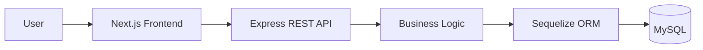
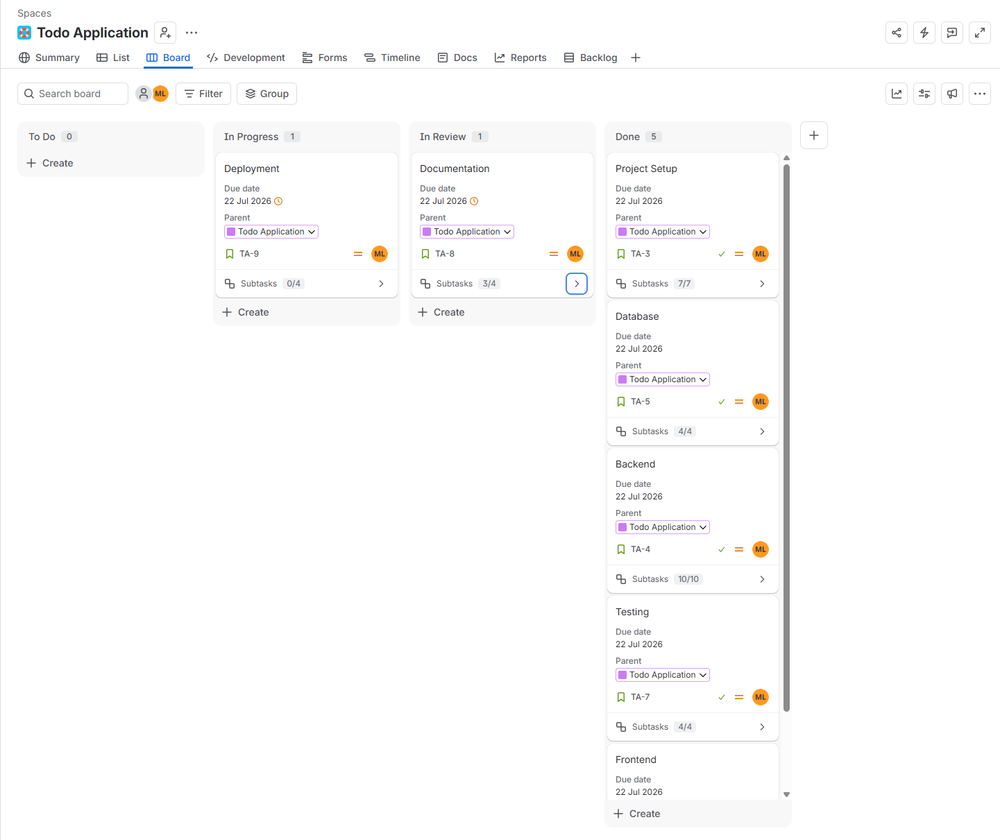
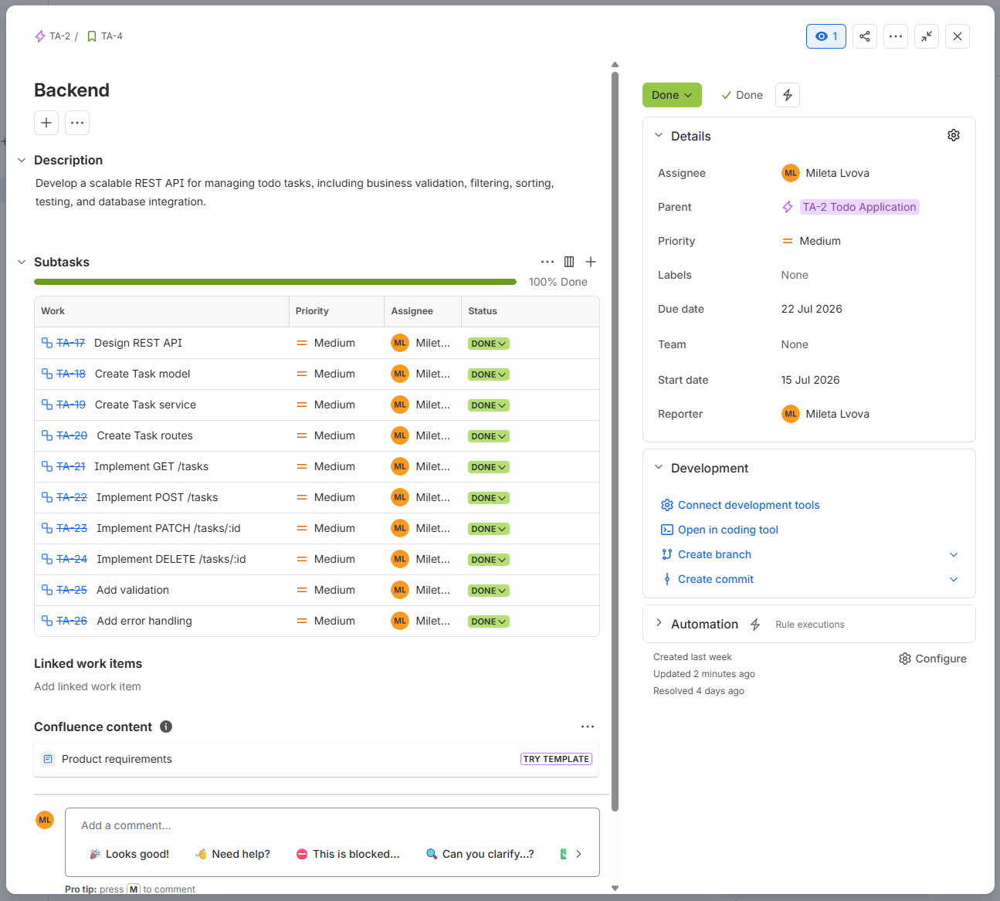
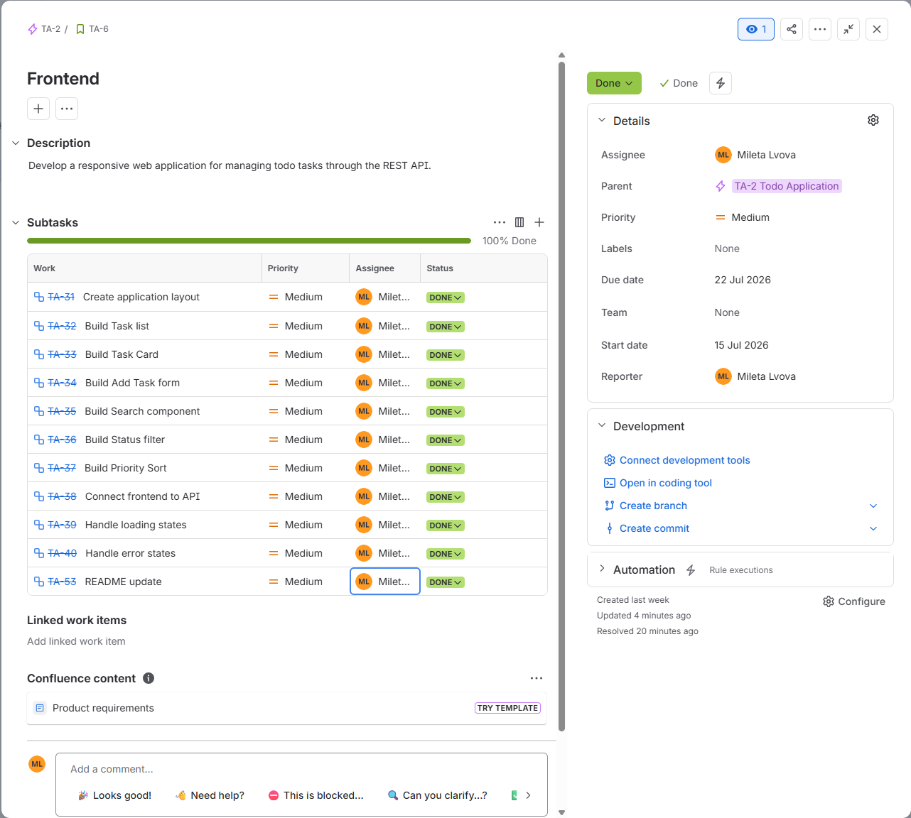

# Todo Application

**Status:** In Progress

## About The Project

Todo Application is a full-stack web application for managing personal tasks.

The project consists of a Next.js frontend and a Node.js/Express REST API connected to a MySQL database using Sequelize ORM. It demonstrates full-stack application development, including RESTful API design, responsive UI development, business validation, testing, and deployment.

---

## Features

- Create, update and delete tasks
- Mark tasks as completed or undone
- Search tasks by name and description
- Filter tasks by completion status
- Sort tasks by priority
- Responsive user interface
- RESTful API
- Business validation
- Interactive Swagger/OpenAPI documentation
- Unit and integration testing

---

## Architecture

---

## Frontend

**Technology**

- Next.js 16
- React 19
- TypeScript
- Tailwind CSS 4
- shadcn/ui

Main responsibilities

- Display tasks
- Create tasks
- Edit tasks
- Delete tasks
- Search tasks
- Filter by status
- Sort by priority
- Consume the REST API

More information is available in the frontend README.

---

## Backend

**Technology**

- Node.js
- Express.js
- TypeScript
- Sequelize ORM
- MySQL

Main responsibilities

- RESTful CRUD API
- Business validation
- Filtering
- Sorting
- Swagger/OpenAPI documentation
- Unit and integration testing

More information is available in the backend README.

---

## Project Management

Development was managed using Jira.

The project followed a Kanban workflow for planning, prioritizing, and tracking development tasks.

### Kanban Board

### Backend Work Item

### Frontend Work Item

---

## Deployment

| Component | Platform |
| ---------- | -------- |
| Frontend | Vercel |
| Backend | Render |
| Database | Aiven MySQL |

---

## Future Improvements

- User authentication (JWT)
- User-specific task ownership
- Pagination
- Categories and tags
- Due dates
- Dark mode
- Docker
- GitHub Actions CI/CD