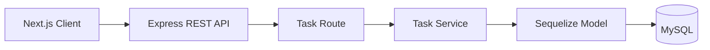

# Todo Application Backend

**Status:** In Progress

## About The Project

The Todo Application Backend is a REST API built with Node.js, Express.js, TypeScript, MySQL, and Sequelize ORM.

It provides a complete backend for managing tasks, including CRUD operations, business validation, filtering, sorting, and intaractive API documentation with Swagger/OpenAPI.

The application is deployed on Render and securely connects to a cloud-hosted MySQL database on Aiven.

---

### Available Endpoints

- **GET /api/tasks** - Retrieve all tasks with optional filtering by status (`done`, `undone`, `all`) and sorting by priority (`asc`, `desc`).
- **GET /api/tasks/:id** - Retrieve a task by ID.
- **POST /api/tasks** - Create a new task.
- **PUT /api/tasks/:id** - Update an existing task.
- **DELETE /api/tasks/:id** - Delete a task.
- Interactive Swagger/OpenAPI documentation.

---

## Features

- RESTful CRUD API
- Business validation in the service layer
- Request validation
- Priority validation at both the service and database levels
- Filtering tasks by completion status
- Sorting tasks by priority
- Interactive Swagger/OpenAPI documentation
- Comprehensive unit and integration test suites with an isolated MySQL test database
- Cloud-hosted MySQL database (Aiven)
- Production deployment on Render

## Architecture



---

## Tech Stack

| Category      | Technologies                                               |
| ------------- | ---------------------------------------------------------- |
| Runtime       | Node.js 22                                                 |
| Backend       | Express.js 5, TypeScript                                   |
| Database      | MySQL, Sequelize ORM                                       |
| Testing       | Jest, Supertest                                            |
| Documentation | Swagger / OpenAPI                                          |
| Deployment    | Render, Aiven MySQL                                        |


---

## API Documentation

Interactive API documentation is available through Swagger.

Development

```
http://localhost:3000/doc
```

Production

```
/doc/
```

### Tasks

| Method | Endpoint              | Description                               |
| ------ | --------------------- | ----------------------------------------- |
| GET    | /api/tasks            | Get all tasks                             |
| GET    | /api/tasks/:id       | Get task by ID                            |
| POST   | /api/tasks            | Create task                               |
| PUT    | /api/tasks/:id       | Update task                               |
| DELETE | /api/tasks/:id       | Delete task                               |

---

## Testing

The project includes both unit and integration tests.

### Unit tests

- TaskService business logic
- Validation rules
- Filtering and sorting logic
- CRUD operations

### Integration Tests

- Complete CRUD workflow
- Request validation
- Error handling
- Filtering
- Sorting
- Test database isolation

Run the test suit

```bash
npm test
```

## Local Development

### Running locally

### Steps

1. Clone the repository

```bash
git clone https://github.com/miletalvova/TodoApp.git
cd TodoApp/backend
```

2. Install dependencies

```bash
npm install
```

3. Create .env

Example:

```
DATABASE_USERNAME=root
DATABASE_PASSWORD=YOURPASSWORD
DATABASE_NAME=todo
DIALECT=mysql
PORT=3000
DATABASE_HOST=localhost
```

4. Start the development server

```bash
npm run dev

```

> [!WARNING]
> Replace all placeholder values with your actual credentials. Never commit .env to version control.

The API will be available at `http://localhost:3000`.

## Deployment

The production backend is deployed on Render and connects to an Aiven MySQL database.

| Component          | Platform       |
| ------------------ | -------------- |
| Backend            | Render         |
| Database           | Aiven MySQL    |


---

## Seed Data

The application can automatically seed the database with sample tasks during development.

To disable seeding, comment out:

```typescript
// await seedTasks();
```
---

## Feature Improvements

- User authentication (JWT)
- User-specific task ownership
- Pagination
- Search by task name
- Due dates
- Categories and tags
- Docker support
- CI/CD with GitHub Actions