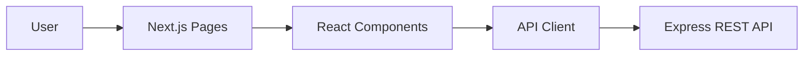

# Todo Application Frontend

**Status:** In Progress

## About The Project

The Todo Application Frontend is a web application built with Next.js, React, TypeScript, Tailwind CSS, and shadcn/ui component library.

It provides a responsive user interface for managing tasks through a REST API, including creating, updating, deleting, filtering, sorting, searching, and marking tasks as completed.

The application communicates with the Todo Application Backend and consumes its REST API.

---

### Features

- View all tasks
- Create new tasks
- Edit existing tasks
- Delete tasks
- Mark tasks as completed or undone
- Search tasks by name or description
- Filter tasks by completion status
- Sort tasks by priority
- Responsive user interface
- Modern UI components built with shadcn/ui

---

## Architecture



---

## Tech Stack

| Category    | Technologies              |
| ----------- | ------------------------- |
| Framework   | Next.js 16                |
| Frontend    | React 19, TypeScript      |
| Styling     | Tailwind CSS 4, shadcn/ui |
| Icons       | Lucide React              |
| HTTP Client | Fetch API                 |
| Backend API | Express.js REST API       |

---

## Application Features

### Task Management

- Create tasks
- Update tasks
- Delete tasks
- Mark tasks as completed or undone

### Task Filtering

- Filter tasks by completion status (`all`, `done`, `undone`)
- Search tasks by name and description
- Sort tasks by priority (`asc`, `desc`)

---

## Local Development

### Running locally

### Steps

1. Clone the repository

```bash
git clone https://github.com/miletalvova/TodoApp.git
cd TodoApp/frontend
```

2. Install dependencies

```bash
npm install
```

3. Create .env

Example:

```env
NEXT_PUBLIC_API_URL=http://localhost:3000/api/tasks
```

4. Start the development server

```bash
npm run dev
```

> [!WARNING]
> Replace all placeholder values with your actual backend URL. Never commit `.env` to version control.

The application will be available at `http://localhost:3001` (or the default Next.js development port).

---

## Project Structure

```text
app/
components/
components/ui/
lib/
types/
public/
```

---

## Testing

The frontend includes automated component tests using **Jest** and **React Testing Library** to verify the behavior of the user interface.

### Covered functionality

- Rendering of UI components
- Form input handling
- Task creation workflow
- Edit mode rendering
- User interactions with form controls
- API call mocking for isolated component testing

### Running tests

Run all tests:

```text
npm test
```

---

## Feature Improvements

- Authentication and user accounts
- Pagination
- Task categories
- Due dates
- Drag-and-drop task ordering
- Dark mode
- Optimistic UI updates
